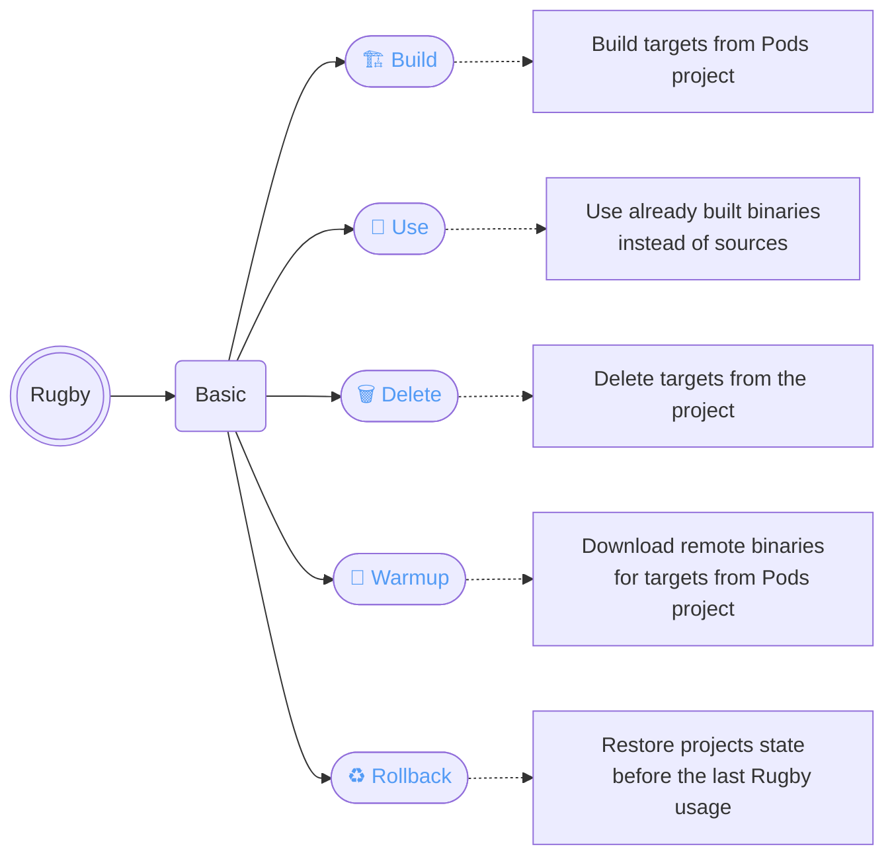
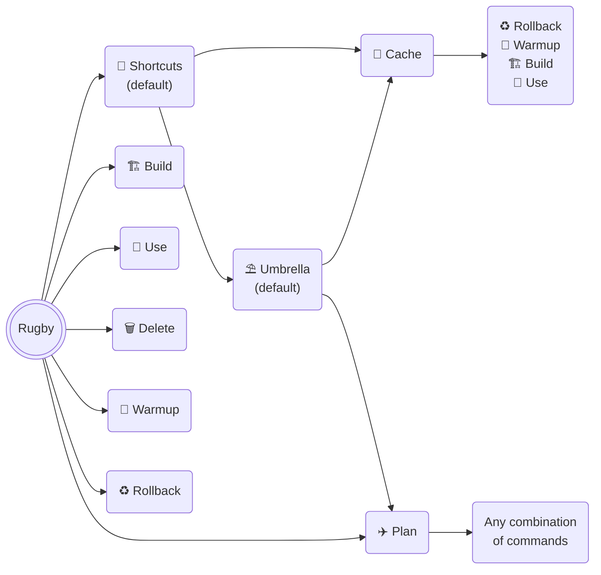
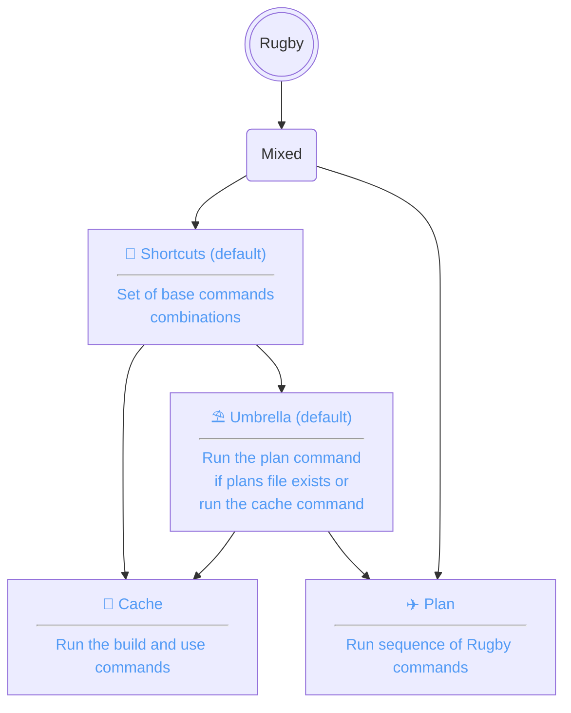
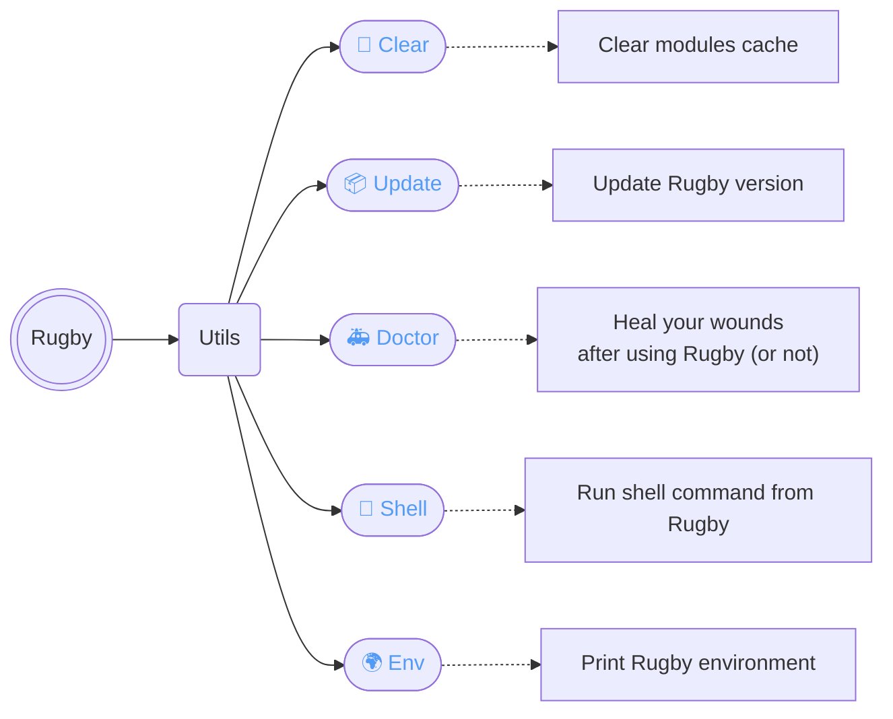

[< Documentation](../README.md)

# 📖 Commands Help

```sh
> rugby --help
```

```sh
 Subcommands:
╭──────────────────────────────────────────────────────────────────────╮
│ shortcuts  * Set of base commands combinations.                      │
│ build      * Build targets from Pods project.                        │
│ use        * Use already built binaries instead of sources.          │
│ delete     * Delete targets from the project.                        │
│ warmup     * Download remote binaries for targets from Pods project. │
│ rollback   * Restore projects state before the last Rugby usage.     │
│ plan       * Run sequence of Rugby commands.                         │
│ clear      * Clear modules cache.                                    │
│ update     * Update Rugby version.                                   │
│ doctor     * Heal your wounds after using Rugby (or not).            │
│ shell      * Run shell command from Rugby.                           │
│ env        * Print Rugby environment.                                │
╰──────────────────────────────────────────────────────────────────────╯
 Flags:
╭──────────────────────────────────────╮
│ --version   * Show the version.      │
│ -h, --help  * Show help information. │
╰──────────────────────────────────────╯
```

| [Basic](#basic) | [Mixed](#mixed) | [Utils](#utils) |
| :---: | :---: | :---: |
| 🏗️ [Build](build.md) | 📍 [Shortcuts](shortcuts.md) | 🧼 [Clear](clear.md) |
| 🎯 [Use](use.md) | ⛱️ [Umbrella](shortcuts/umbrella.md) | 📦 [Update](update.md) |
| 🗑️ [Delete](delete.md) | 🏈 [Cache](shortcuts/cache.md) | 🚑 [Doctor](doctor.md) |
| 🐳 [Warmup](warmup.md) | ✈️ [Plan](plan.md) | 🐚 [Shell](shell.md) |
| ♻️ [Rollback](rollback.md) | | 🌍 [Env](env.md) |

## Basic



## Mixed





## Utils


